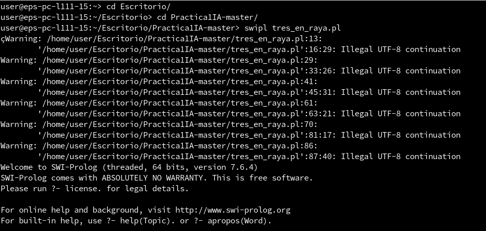
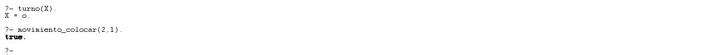
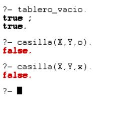

1. Problema elegido: Representación de las reglas del "tres en raya"
	- Programa que permite a dos personas jugar entre ellas al tres en raya de forma manual a través de la consola SWI-Prolog.

2. Reglas del sistema en lenguaje natural:
	- En el tres en raya juegan dos personas; Jugador 1(X) y Jugador 2(O) Con lo cual existen dos turnos el turno de las X y el turno de las O. 

		- La partida la empieza un jugador por defecto, entonces es su turno.
		- El jugador realiza un movimiento de una de sus fichas y acto seguido finaliza su turno y pasa a ser el turno el jugador contrario. Esto se repite sucesivamente hasta que acabe la partida y uno de los dos jugadores gane.
		
	- Se juega en un tablero de 9 casillas, formado por tres filas y tres columnas como el siguiente. Cada casilla del tablero está codificada de la siguiente forma:
		| Columna 1 | Columna 2 | Columna 3 |
		| -- | -- | -- |
		| 1,1 | 1,2 | 1,3 |
		| 2,1 | 2,2 | 2,3 |
		| 3,1 | 3,2 | 3,3 |
	

	- Hay dos fases en la partida y según la fase en la que se encuentre la partida, un jugador podrá hacer un tipo de movimiento u otro:
		- Fase 1 de la partida / Fase inical
			- Los jugadores tienen que hacer el movimiento_colocar, en el que colocan una de sus fichas en una casilla del tablero que este vacía.
			- Esta fase termina cuando ambos jugadores han colocado todas sus fichas en el tablero, es decir, al cabo de 3 turnos de un jugador, 6 turnos contando los dos jugadores. Una vez estén todas las fichas colocadas, la fase 1 termina y comienza la fase 2.
			
			
		- Fase 2 de la partida / Fase final
			- Los jugadores tienen que hacer el movimiento_desplazar, en el que mueven una de sus fichas del tablero a una casilla que se encuentre vacía en ese momento con el objetivo final de conseguir tener sus 3 fichas alineadas en el tablero, ya sea las 3 en una misma fila, las 3 en una misma columna o las 3 formando una diagonal. Cuando sucede esto decimos que el jugador que lo ha conseguido ha hecho tres en raya, y gana la partida; por tanto se acaba el juego.
	
3. Manual de juego para los usuarios
	- Abrir SWI-Prolog - File - Consult - tres_en_raya.pl
	- Si el juego ha cargado correctamente deberá aparecer una pantalla como la siguiente:
	
	- Por defecto esta programado para que empiece automaticamente por el jugador O, pero si se desea cambiar el orden, basta con escribir cambiar_turno. y para comprobar a quien le toca mover escribir turno(X). En esta imagen se ve como empieza por defecto el jugador O, pero lo cambiamos para que empiece el jugador X. Importante, todas los comandos que se introduzcan en la consola de SWI-Prolog deben acabar con un punto.
	
	- Una vez hayamos decidido que jugador empieza, comenzamos la partida. 
	- En este manual empezará la partida el jugador O, como está programado por defecto, sin tocar nada.
	- Fase 1 de la partida:
		- Cada jugador va realizando el movimiento_colocar(X, Y) donde X e Y son las coordenadas del tablero donde se desea mover la ficha, siendo el tablero el descrito en las reglas del juego.
		- A continuación simulamos el turno del jugador O:
	- 

	- Automaticamente, se cambia de turno, y el estado del tablero sería el siguiente:
		| Columna 1 | Columna 2 | Columna 3 |
		| -- | -- | -- |
		| --- | --- | --- |
		|  O  | --- | --- |
		| --- | --- | --- |
		
	- Seguimos simulando la partida hasta completar los 3 turnos de cada jugador de la fase 1:

	

	- Como se ve en la simulación ejecutamos turno(X). para ver a quien le toca hacer un movimiento, pero no hace nada realmente ese método en la partida, es simplemente informativo, por lo que simulamos el resto de los movimientos suponiendo que primero mueve jugador o y el movimiento siguiente es del jugador x.

	- Tras simular los 6 turnos de la fase 1 como se ve en la imagen. el tablero ha quedado de la siguiente forma:
		| Columna 1 | Columna 2 | Columna 3 |
		| -- | -- | -- |
		|  O  |  X  |  O  |
		|  O  |  X  | --- |
		|  X  | --- | --- |

	- Si en algún momento un jugador quiere comprobar en que posiciones del tablero se encuentran sus fichas, puede escribir el comando casilla(X,Y,o) donde el tercer parámetro varía en funcion de si quieres saber en que posiciones se encuentran las O o las X.
	
	- Realizamos la comprobación:

	

	- El comando devuelve la posición de una ficha, hay que escribir ";" al final de cada posicion que te devuelve, y te muestra dodne esta colocada la siguiente ficha, así hasta que ya te ha indicado donde están colocadas tus tres fichas.
	- Como se ve en la imagen, las posiciones que se muestran por consola coinciden con los movimientos que hemos ido haciendo.
	
	- Ahora que hemos colocado todas las fichas en el tablero, comienza la Fase 2, que sigue exactamente la misma dinámica que la Fase 1, solo que ahora en cada turno se realiza el movimiento_desplazar(X1, Y1, X2, Y2). donde (X1,Y1) tienen que ser las coordenadas origen de una ficha que tienes colocada en el tablero, y (X2,Y2) son las coordenadas de la casilla destino a la que quieres desplazar la ficha seleccionada. Por supuesto, (X2,Y2) tiene que ser una casilla vacía para poder desplazar una ficha a esa posición.
	- Continuamos la simulación de la Fase 2, hasta que uno de los jugadores consiga hacer tres en raya, que es tener las 3 fichas alineadas en el tablero ya sea en una misma fila, columna o diagonal:

	- Turno Jugador O => movemos la ficha que se encuentra en (1,3) a la casilla (3,2):

	

	- El tablero queda así:
		| Columna 1 | Columna 2 | Columna 3 |
		| -- | -- | -- |
		|  O  |  X  | --- |
		|  O  |  X  | --- |
		|  X  |  O  | --- |
	
	- Turno Jugador X => movemos la ficha que se encuentra en (1,2) a la casilla (1,3)
	- De esta formá se conseguirá tener tres en raya en diagonal y se ganará la partida:

	

	- Resultado final; Visión del tablero:

		| Columna 1 | Columna 2 | Columna 3 |
		| -- | -- | -- |
		|  O  | --- |  X  |
		|  O  |  X  | --- |
		|  X  |  O  | --- |

	- Ha ganado el Jugador X, la partida ha finalizado.

	- Si se quisiera jugar otra partida, basta con escribir el comando tablero_vacio, y se reiniciará el tablero para que se pueda volver a empezar la partida:

	

	- Como se ve en la imagen, también podemos usar el comando casilla(X,Y,x) y casilla(X,Y,o) para comprobar que el tablero está vacío, ya que si nos devuelve false los dos comandos, es que no hay ninguna ficha colocada en el tablero.

	- Fin del manual.

	

			
	
4. Modelo conceptual. Diagrama de flujo del juego:

	
	
	
	

5. Programa con el código: "tres_en_raya.pl"

